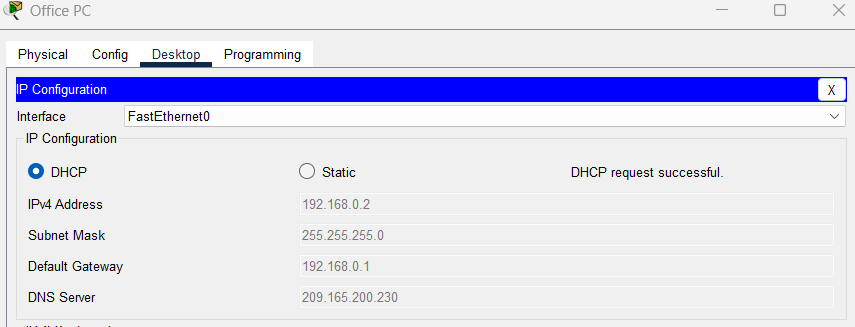
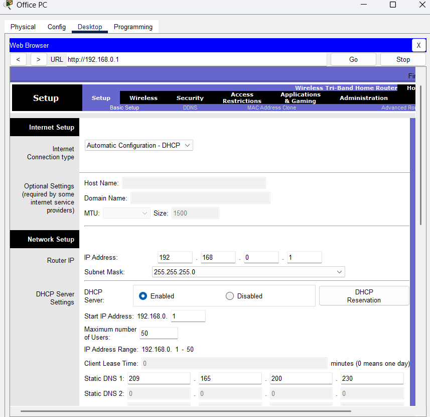
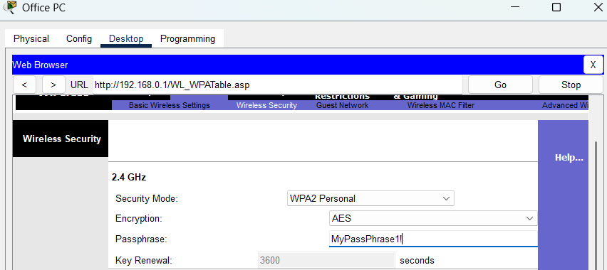
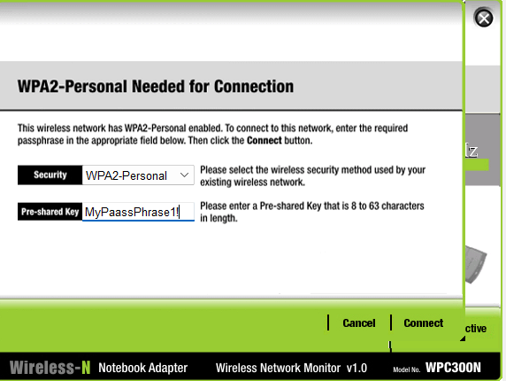
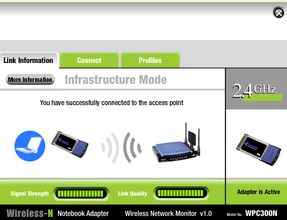
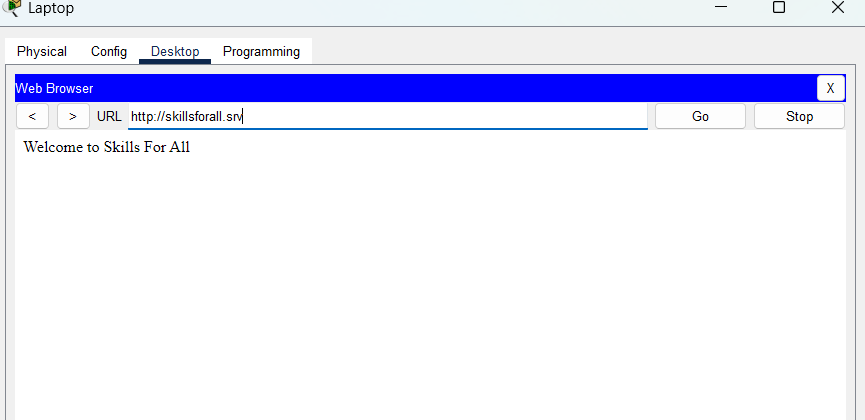
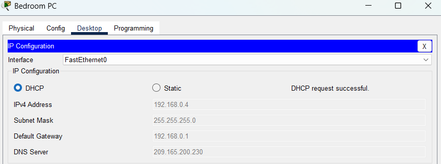
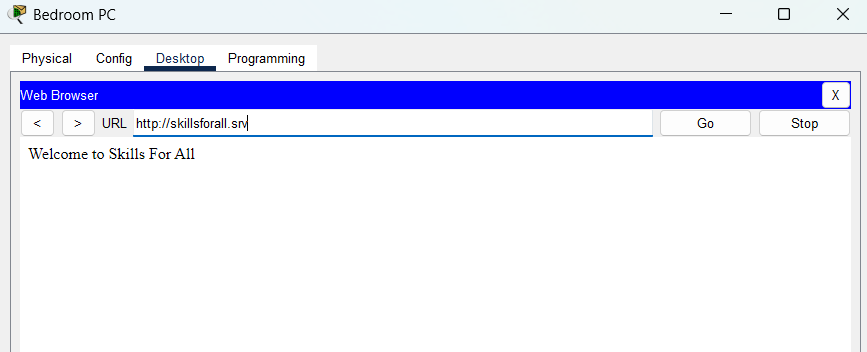
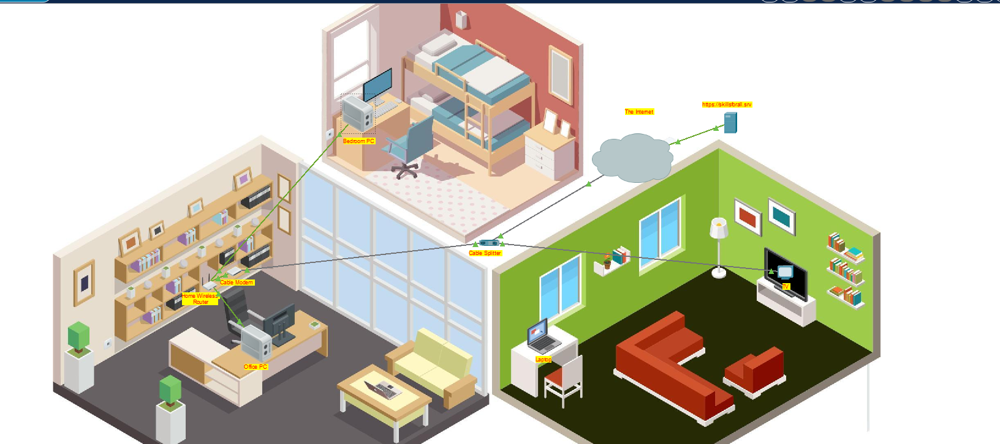

# Configure-a-Wireless-Router-and-Clients
This project simulates the configuration of a home wireless router and client devices using Cisco Packet Tracer. The goal was to connect multiple wired and wireless devices to the router, configure IP addressing, enable wireless security, and verify internet connectivity.
This lab demonstrates:
- Understanding of home network topology (cable modem, router, splitter, PCs, and wireless laptop).
- Configuring a router GUI (DHCP, wireless SSID, WPA2 security).
- Assigning IP addresses dynamically (DHCP).
- Verifying connectivity through skillsforall.srv and ping tests.

## Objection
1. Connect Devices (Wired & Wireless) to the home router.
2. Configure the wireless router (DHCP, username/password, SSID, WPA2 security).
3. Configure IP addressing for end devices.
4. Test connectivity across all hosts.

## Part 1: Connect the devices
In this project internet and video services are delivered through a coaxial cable. The cable is connected to an outlet in the home and a splitter devices seperates the internet data services from the video services. This enables the two services to be connected to the appropriate devices.

# Step 1: Connect the coaxial cables
Connected the Cable Splitter to the Cable Modem for the internet connection.

Connections → Coaxial cable → Cable Splitter → Coaxial1 port → Cable Modem → Port 0.
Connected the Cable Splitter to the TV for video connection.
Connections → Coaxial cable → Cable Splitter → Coaxial2 port → TV → Port 0.

Turned the TV on and an image appeared to represent a TV program confirming connectivity.

# Step 2: Connect the network cable
In this packet tracer activity there are two PC's in the house that don't have wireless LAN adapters, therefore they will need to be connected  with Ethernet cables. 

For the Home Wireless Router to access the internet over the cable TV provider network the Cable Modem needs to be connected to the Home Wireless Router internet port using a copper straight-through cable.

Connections → Copper Straight-Through Cable → Cable Modem → Port 1 → Home Wireless Router → Internet port.

Connections → Copper Straight-Through Cable → Office PC → FastEthernet0 port → Home Wireless Router → GigabitEthernet1 port.

Connections → Copper Straight-Through Cable → Bedroom PC → FastEthernet0 port → Home Wireless Router → GigabitEthernet2 port.

After these steps the wired home network is fully connected to the internet through the cable TV provider network.

## Part 2: Configure the Wireless Router
# Step 1: Access the Home Wireless Router GUI.
The Home wireless routers are configured using a graphical user interface (GUI) which is accessed through the computers web browsers. To accomplish this we follow the following steps.

Office PC → Desktop tab → IP Configuration → DHCP 

After clicking DHCP it automatically configured the Office PC to be on the same IP network as the Home Wireless Router. 

To continue the configuration process, using the web browser I have pasted the default gateway into the browser. 

As the Home Router is newly installed I used default credientials such as 'Admin' for both the User Name and Password. The GUI for the Home Wireless Router appeared ready to continue configuring the network. 

# Step 2: Configure Basic Settings
Now that I have accesseed the GUI I now needed to change the User name and Password from the default ones provided to my own. To do this I followed the following steps.

Administration tab → New password → Save Settings → Enter new credentials → Continue

# Step 3: Configure a wireless LAN
To connect wireless devices to the home wireless network over WIFI I enabled the 2.4 GHz network. 

Wireless tab → 2.4 GHz → Enable

I then changed the SSID from the default name to 'MyHome' so that those searching for my network can find it. I then saved these settings. 

To set up security for my network I enabled WPA2 Personal and created a PassPhrase so that my netwrok can ony be accessed by those I provided my PassPhrase to and then saved these settings. 

## Part 3: Configure IP Addressing and Test Connectivity
Now that my router is configured I configured the IP address for my home PC and Laptop to connect wirelessly to the internet. 

Laptop → Desktop tab → PC Wireless → Connect tab 

In the connect tab I entered the Passphrase in the Pre-shared Key field and clicked connect.

To test the connectivity I opened the Web browser on the Laptop and did a search using the website 'Skillsforall.srv' and a verification appeared confirming connectivity 

To connect the Bedroom PC the the wireless network in enabled DHCP to recieve an IP address 

To verify connectivity I did the same web browser search I did preciously for the laptop

I have now completed connecting the network devices, configured the router and wireless LAN and configure all hosts to the Home Network. 

This is my final Topology.

