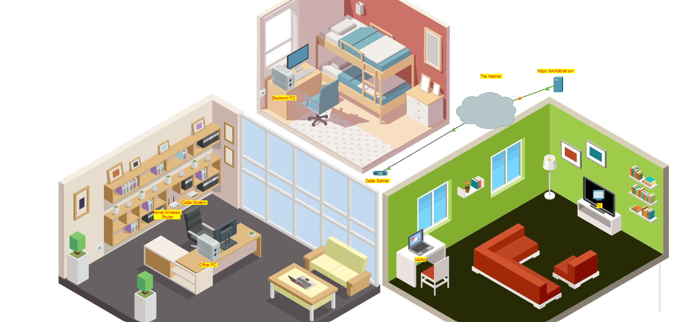
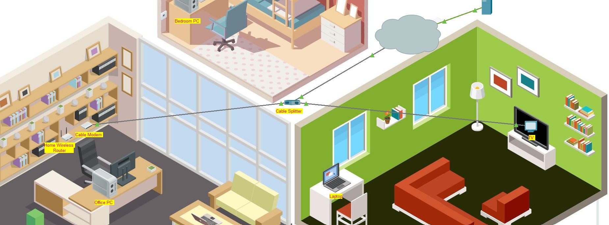
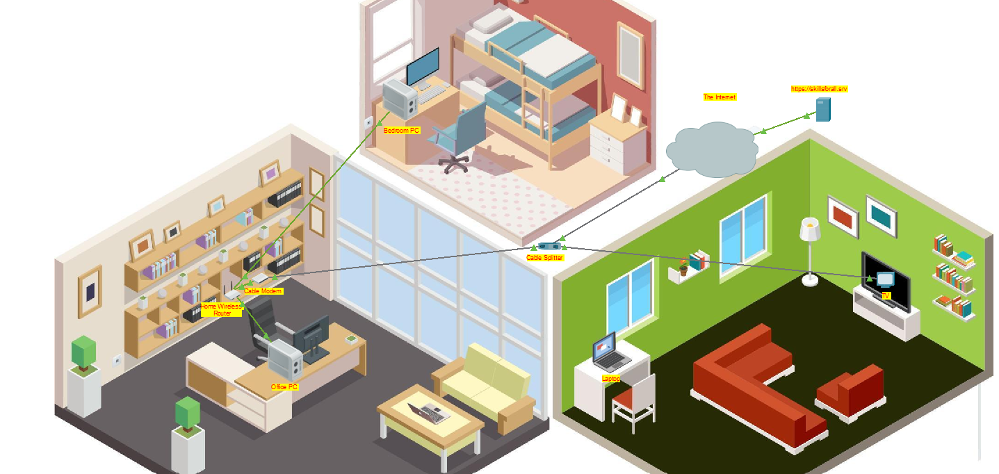

# Configure-a-Wireless-Router-and-Clients
This project simulates the configuration of a home wireless router and client devices using Cisco Packet Tracer. The goal was to connect multiple wired and wireless devices to the router, configure IP addressing, enable wireless security, and verify internet connectivity.
This lab demonstrates:
- Understanding of home network topology (cable modem, router, splitter, PCs, and wireless laptop).
- Configuring a router GUI (DHCP, wireless SSID, WPA2 security).
- Assigning IP addresses dynamically (DHCP).
- Verifying connectivity through skillsforall.srv and ping tests.

## Objection
1. Connect Devices (Wired & Wireless) to the home router.
2. Configure the wireless router (DHCP, username/password, SSID, WPA2 security).
3. Configure IP addressing for end devices.
4. Test connectivity across all hosts.

## Part 1: Connect the devices
In this project internet and video services are delivered through a coaxial cable. The cable is connected to an outlet in the home and a splitter devices seperates the internet data services from the video services. This enables the two services to be connected to the appropriate devices.

# Step 1: Connect the coaxial cables
Connected the Cable Splitter to the Cable Modem for the internet connection.
Connections → Coaxial cable → Cable Splitter → Coaxial1 port → Cable Modem → Port 0.
Connected the Cable Splitter to the TV for video connection.
Connections → Coaxial cable → Cable Splitter → Coaxial2 port → TV → Port 0.

Turned the TV on and an image appeared to represent a TV program confirming connectivity.

# Step 2: Connect the network cable
In this packet tracer activity there were two PC's in the house that didnt have wireless LAN adapters so needed to be connected with Ethernet cables. For the Home Wireless Router to access the internet over the cable TV provider network therefore the Cable Modem needed to be connected to the Home Wireless Router internet port using a copper straight-through cable.
Connections → Copper Straight-Through Cable → Cable Modem → Port 1 → Home Wireless Router → Internet port.
Connections → Copper Straight-Through Cable → Office PC → FastEthernet0 port → Home Wireless Router → GigabitEthernet1 port.
Connections → Copper Straight-Through Cable → Bedroom PC → FastEthernet0 port → Home Wireless Router → GigabitEthernet2 port.
After these steps the wire home network is fully connected to the internet through the cable TV provider network.

## Part 2: Configure the Wireless Router
Step 1: Access the router GUI

From the Office PC, enabled DHCP to receive IP.

Accessed the router GUI via its default gateway IP.

Logged in with default credentials (admin / admin).

My first step is to connect the internet services to the cable modem, and the video service to the television. 

